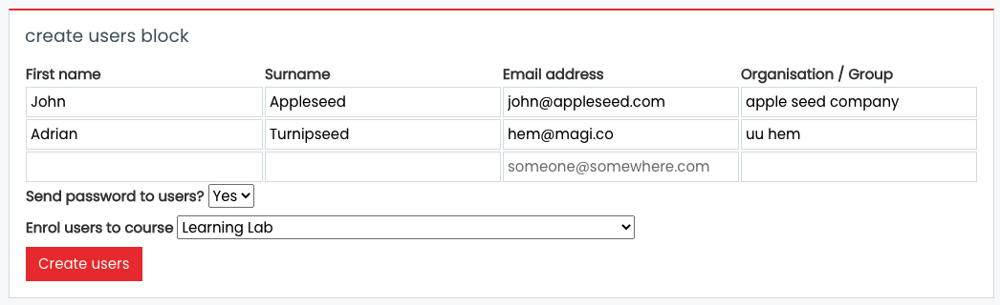

# block_createusers
Moodle block for rapidly creating one or more users, sending their details, optionally enrolling them to a course and group.

New user rows are added automatically once you start typing in an existing row. Hit tab to swtich between fields.

Users with the same email address as existing users will be skipped.
Usernames are set to the email address.
Passwords are generated and sent to the user if an option is set. Otherwise the password is set to 'secret' and the user record is set so the user has to change their password on the next login.
If a course is specified, newly added users will be enrolled to the course using the 'manual' auth plugin. this must be enable on the course already.
Organisations are optional. If set it will use this value on the 'Institution' field on the user record, and if a course is specified it will also create a group within the course with this name (if required) and make this user a member of that group.

## Licence

GPL3 as per moodle